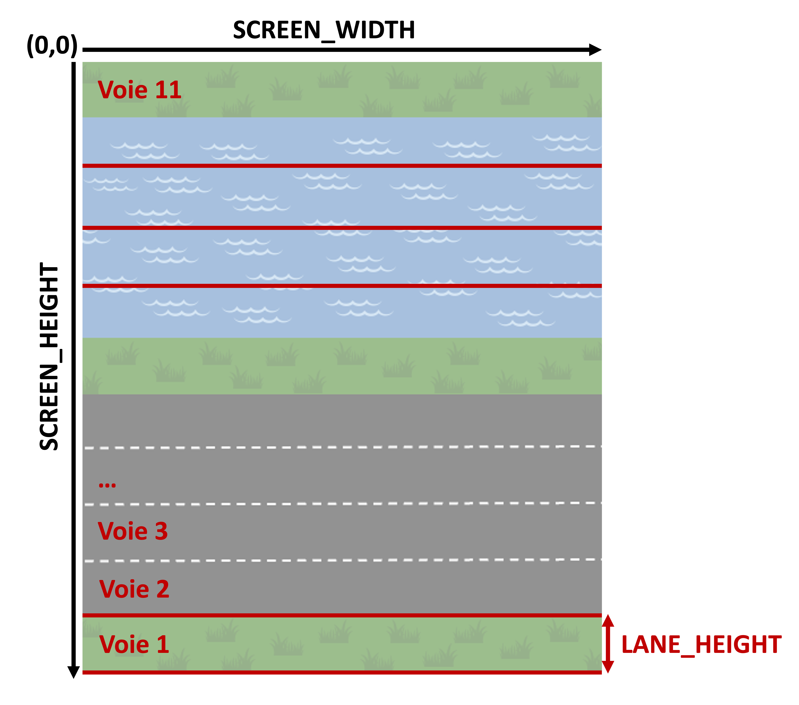

# Projet 1 - INF1007 Automne 2025

## Directives
:alarm_clock: Date de remise : 19 octobre 2025 à minuit

:mailbox_with_mail: À remettre sur Moodle (voir les directives en bas de la page)

## Introduction
Dans ce projet, vous aurez comme tâche de compléter une version du jeu [Frogger](https://en.wikipedia.org/wiki/Frogger) 🐸. Ce jeu, créé en 1981, a comme objectif de guider une grenouille ("Frogger") à traverser des routes, sans se faire frapper par des voitures, puis une rivière, en sautant sur des bûches de bois. 

Le joueur gagne lorsque la grenouille atteint la dernière zone de pelouse, tout en haut de l'écran. 

La grenouille dispose de 3 vies. Elle perd une vie si elle est frappée par une voiture, ou tombe dans la rivière.  

Afin de simplifier votre travail, l’interface graphique du jeu est déjà fournie. Votre tâche consistera à ajouter les entités du jeu (grenouille, voitures et bûches de bois), à gérer leurs mouvements, ainsi qu’à détecter les collisions avec les voitures ou lorsque la grenouille est posée sur une bûche. 

Le jeu final devrait ressembler à l'exemple visible ici : 

https://github.com/user-attachments/assets/25a8ae65-1555-4712-9da4-f17c8fadea15

(Si vous n'arrivez pas à visionner la vidéo dans votre navigateur, elle est aussi disponible dans le dossier `images/`) : 

## Installations requises
Ce projet nécessite l'utilisation de la bibliothèque [`pygame`](https://www.pygame.org/wiki/about), qui permet de créer facilement des interfaces de jeu en Python.

Avant de commencer, vous devez vous assurer que pygame est installé sur votre ordinateur. Pour installer la version 2.6.0, assurez-vous d'abord que l'environnement conda `INF1007` est activé dans VS Code :

```
conda activate INF1007
```

Ensuite, pour installer pygame, entrez la commande suivante dans le terminal de VS Code : 

```
pip install -U pygame==2.6.0
```

## Informations sur le projet
### Structure du projet
Le projet est organisé de la manière suivante : 

```plaintext
2025A_PR01/
├── images/
├── frog.py
├── cars.py
├── wood_logs.py
├── config.py
├── main.py
├── window.py
├── game.py
```
### Détails sur les fichiers : 

- Le dossier `images/` contient les images (en format `.png`) de la grenouille, des voitures et des bûches de bois. Ces images seront utilisées pour créer les dictionnaires représentant les entités du jeu.

- Le fichier `frog.py` contient le code pour initialiser la grenouille, c'est-à-dire pour charger l'image de la grenouille et de créer un dictionnaire pour y stocker ses propriétés, telles que sa position, sa taille, etc. 

- Les fichiers `cars.py` et `wood_logs.py` contiennent les dictionnaires pour initialiser les voitures et les bûches de bois.

- Le fichier `config` contient des variables du jeu. Les variables sont les suivantes : 

     - `SCREEN_WIDTH` : la largeur de l'écran de jeu
     - `SCREEN_HEIGHT` : la hauteur de l'écran de jeu
     - `NUM_OF_LANES` : le nombre de voies (incluant 3 pelouses, 4 voies de routes et 4 voies de rivière), qui est égal à 11.
     - `LANE_HEIGHT` : la hauteur d'une voie, qui est calculée par `SCREEN_HEIGHT / NUM_OF_LANES`
     - `FROG_SIZE` : la taille de l'image de la grenouille
     - `LANES` : Liste des voies, qui va contenir un dictionnaire contenant des informations pour chaque voie (ex: la position en y, la vitesse des voitures ou des bûches, etc.)
     - `CAR_COLORS` : la liste des couleurs possibles pour les voitures
     - `CARS_SIZE` : la taille pour les images des voitures
     - `LOG_SIZES` : les tailles possibles pour l'image des bûches de bois ("small", "medium" et "long")
     - `LIVES` : le nombre de vies initiales de la grenouille (qui est égal à 3)
     - `FPS` : le nombre d’images par seconde ("frames per second")

Le schéma suivant illustre les variables `SCREEN_WIDTH`, `SCREEN_HEIGHT` et `LANE_HEIGHT`. À noter que la coordonnée `(0,0)` se retrouve en haut à gauche de l'écran du jeu.



L'écran de jeu compte 11 voies au total, c'est-à-dire :
- **Voie 1** : Première pelouse, position intiale de la grenouille
- **Voies 2, 3, 4 et 5** : Voies de route avec les voitures
- **Voie 6** : Pelouse entre la route et la rivière
- **Voies 7, 8, 9 et 10** : Voies de rivière avec bûches de bois
- **Voie 11** : Dernière pelouse, position de victoire. 

# Travail à réaliser

Vous devez compléter les parties suivantes à l'intérieur des fichiers `frog.py`, `cars.py`, `wood_logs.py`, `window.py` et `game.py`. **Pour lancer le jeu, vous devez exécuter le fichier `main.py`**.

> [!IMPORTANT]
> Plusieurs fonctionnalités clés, comme la perte de vie lorsqu’une voiture touche la grenouille ou les affichages de victoire et de défaite, sont déjà implémentées pour vous.
Prenez le temps de lire et comprendre le code existant, en particulier les fonctions fournies, afin de bien saisir le fonctionnement du jeu. Cela vous aidera à savoir où et comment ajouter le code demandé dans les étapes ci-dessous.

## PARTIE 1 : La grenouille 🐸

### 1.1 : Définition du dictionnaire `frog_dict`

Dans le fichier `frog.py`, vous avez le dictionnaire `frog_dict` suivant, qui contient les informations relatives à la grenouille : 

```
frog_dict = {
    "x": 1000,
    "y": 1000,
    "size": FROG_SIZE,
    "speed": LANE_HEIGHT,
    "on_log": False, # Si la grenouille se retrouve sur la bûche (True) ou non (False)
    "log_speed": 0, 
    "in_water": False,
    "water_timer": 0,
    "has_won": False,
    "lives": LIVES
}
```
Ce dictionnaire est déjà défini pour vous. Cependant, la position de la grenouille (définie par les clés `x` et `y`), n'est pas la bonne. La première étape du projet est de modifier les valeurs de ces clés de manière à ce que la grenouille apparaisse **au centre de la première voie de pelouse, en bas de l'écran**.

Pour ce faire,  **vous devez utiliser les variables `SCREEN_WIDTH`, `SCREEN_HEIGHT`, `LANE_HEIGHT` et `FROG_SIZE`**, déjà définies dans le fichier `config.py`. 

À la fin de cette première partie, la grenouille devrait apparaître au centre de la première pelouse lorsqu'on démarre le jeu (exécute `main.py`). 

### 1.2 : Contrôle du mouvement de la grenouille avec les touches du clavier

Maintenant, vous devez permettre à l’utilisateur de déplacer la grenouille à l’aide des flèches du clavier (←, ↑, →, ↓).

Pour ce faire, vous devez compléter la fonction `handle_input`, qui se retrouve à l'intérieur du fichier `game.py`. Cette fonction sera responsable de détecter les mouvements de type **touche pressée (`KEYDOWN`)** et de mettre à jour la position de la grenouille en conséquence. 

**Détails à respecter :** 
- À chaque fois qu'une touche est pressée, modifiez la position de la grenouille (`x` ou `y`) d’un nombre de pixels égal à la valeur de `frog_dict["speed"]`.
- Les directions du mouvement :
     - `K_LEFT` : gauche
     - `K_RIGHT` : droite
     - `K_UP` : haut
     - `K_DOWN` : bas
- **Important** : assurez-vous que la grenouille reste à l’intérieur de l’écran du jeu. Vous devrez contraindre ses coordonnées x et y à rester entre 0 et les dimensions maximales de la fenêtre (`SCREEN_WIDTH`, `SCREEN_HEIGHT`).  *Indice : Vous pouvez utiliser les fonctions `min()` et `max()` de Python*. 

**Détails supplémentaires sur les les événements dans Pygame :** 

- Pour gérer les touches du clavier dans Pygame, vous devez utiliser les événements KEYDOWN. 
- Pygame détecte chaque action de l'utilisateur (clavier, souris, etc.) comme un événement ("event"). Commencez par vérifier si l'événement est de type "KEYDOWN" (touche enfoncée), comme ceci :

```
if event.type == pygame.KEYDOWN:
```

Ensuite, vous pouvez vérifier quelle touche a été pressée, par exemple : 

```
if event.key == pygame.K_LEFT:
          # Déplacer la grenouille vers la gauche
```

## PARTIE 2 : Les voitures 🚗

### 2.1 : Ajout des voitures dans le dictionnaire `cars_dict`

Dans cette partie du projet, vous allez devoir ajouter les images des voitures que l'on utilisera dans le jeu dans un dictionnaire nommé `cars_dict`. 

Les images des voitures sont situées dans le dossier `images/`. Vous remarquerez que chaque couleur de voiture possède deux versions : une orientée vers la droite ("_right") et une vers la gauche ("_left"). L'objectif est d'organiser ces images dans le dictionnaire `cars_dict`, en fonction de leur direction.

Le dictionnaire `cars_dict` **à l'intérieur du fichier `cars.py`** est initialisé comme suit : 

```
cars_dict = {
    "left": [],
    "right": []
}
```
La liste des couleurs des voitures est disponible dans le fichier `config.py` via la variable `CAR_COLORS`. 

**Étapes à suivre :**

1. Parcourir la liste des couleurs (`CAR_COLORS`) à l'aide d'une boucle
2. Pour chaque couleur : 
     - Chargez l'image vers la droite ("_right") et celle vers la gauche ("_left") à l'aide de `pygame.image.load()`. 
     - Redimensionnez chaque image à `CARS_SIZE` à l’aide de la fonction 
     `pygame.transform.scale()`. 
     - Ajoutez les images redimensionnées dans la bonne liste ("left" ou "right") du dictionnaire `cars_dict`.

### 2.2 : Ajout des voitures dans le jeu

Dans cette section, vous allez créer les voies de circulation (les "lanes") contenant les voitures qui se déplacent à une vitesse aléatoire. 

Pour ce faire, vous allez compléter la section `#TODO` à l'intérieur du fichier `window.py`.  

L'objectif est d'ajouter les dictionnaires représentant des voies de type "car" dans la liste `LANES`. Chaque voie devra contenir des voitures qui :
- apparaissent à une position de départ différente
- avancent dans une direction précise (droite ou gauche)
- se déplacent à une vitesse choisie aléatoirement parmi [2, 3, 4]. 

**Étapes à suivre :** 
- Créer une boucle pour ajouter 4 voies de route.
- Pour chaque voie :
     - Calculez la position verticale (y) à partir du bas de l'écran, en tenant compte de l'index de la voie (la première route commence à la deuxième voie)
     - Définissez la direction : les voies paires (i=0,2) vont vers la droite, les voies impaires (i=1,3) vont vers la gauche
     - Attribuez une vitesse aléatoire parmi [2, 3, 4], avec un signe positif ou négatif selon la direction.
     - Initialisez une liste `cars=[]`, qui permettra de stocker un dictionnaire pour chaque voiture contenue dans cette voie. 

     - Créer une deuxième boucle pour ajouter 3 voitures dans cette voie

- Dans cette deuxième boucle, pour chaque voiture :
     - Définissez un dictionnaire `car`, contenant les clés suivantes :
 ```
car = {
       "width": 
       "height": 
       "x":         
       "y":      
       "image": 
       }
```
où : 

- `width` doit être égale à la largeur de la voiture (utilisez la variable `CARS_SIZE`)
- `height` doit être égale à la hauteur de la voiture (utilisez la variable `CARS_SIZE`)
- `x` est une position aléatoire en x. Cette valeur est calculée en multipliant l'indice de la voiture par un espacement (par exemple, 250 pixels) pour éviter que les voitures se chevauchent sur la voie, puis en ajoutant un décalage aléatoire pour varier leur placement. 
- `y` est la position en y de la voiture, c'est-à-dire le centre de la voie. Vous devez utiliser `LANE_HEIGHT` et la hauteur de la voiture pour faire le calcul.
- `image` est l'image de la voiture, sélectionnée aléatoirement dans le dictionnaire `cars_dict` et correspondant à la direction choisie dans la boucle précédente.

     - Ensuite, vous devez ajouter ce dictionnaire à la liste `cars`.
       
- Une fois que les trois voitures ont été ajoutées à la liste `cars`, ajoutez le dictionnaire suivant à la liste `LANES` :

```
    LANES.append({
        "type":
        "speed": 
        "y":
        "entities": 
    })
```
où : 

- `type` doit être égal à "road"
- `speed` est égale à la vitesse choisie aléatoirement pour la voie (dans la première boucle)
- `y` est la position en y de la **voie**, définie dans la **première boucle**.
- `entities` est égale à votre liste `cars`. 

### 2.3 : Gestion des collisions entre la grenouille et les voitures

Vous allez maintenant implémenter une fonction de détection de collisions entre la grenouille et les voitures. L'objectif est de vérifier si la grenouille entre en contact avec une voiture, ce qui doit déclencher la perte de 1 vie. 

Pour cette partie, vous devez compléter la fonction `check_collision()` dans le fichier `game.py`. Cette fonction doit :
- [Créer un rectangle pygame (`pygame.Rect`)](https://www.pygame.org/docs/ref/rect.html) représentant la grenouille.
- Parcourir toutes les voies de type `car` dans la liste `LANES`.
- Vérifier s'il s'agit d'une voie de type `road`
- Pour chaque voiture dans la voie :
     - Créer un rectangle pygame (`pygame.Rect`) basé sur l'image et la position de la voiture.
     - Vérifier si ce rectangle entre en collision avec celui de la grenouille, à l’aide de la méthode [`pygame.Rect.colliderect()`](https://www.pygame.org/docs/ref/rect.html#pygame.Rect.colliderect).
- Retourner `True` si une collision est détectée, sinon `False`.

## PARTIE 3 : Les bûches de bois 🪵

### 3.1 : Définition du dictionnaire `logs_dict`

Dans cette section, vous allez préparer les images des bûches de bois qui apparaîtront dans la rivière. Ces bûches permettront à la grenouille de traverser la rivière. 

On souhaite avoir trois tailles différentes de bûches. Ces tailles sont définies dans un dictionnaire dans le fichier `config.py`:
```
LOG_SIZES = {
    "short": (60, 40),
    "medium": (80, 40),
    "long": (120, 40)
}
```

L'objectif de cette partie est de charger l'image de la bûche (située dans le dossier `images/`) dans un dictionnaire nommé `logs_dict`, où :
- Chaque clé correspond à une taille ("short", "medium", "long")
- Chaque valeur est l’image chargée et redimensionnée selon les clés `short`,  `medium` et  `long` du dictionnaire `LOG_SIZES`. 

**Étapes à suivre:**
Dans le fichier `wood_logs.py` : 
- Créez un dictionnaire nommé `logs_dict` avec les trois clés : "short", "medium", "long"
- Utilisez `pygame.image.load()` pour charger l'image de bûche à partir du dossier `images/`, **trois fois**, c'est-à-dire une fois pour chaque taille. 
- Redimensionnez chaque image en utilisant les clés du dictionnaire `LOG_SIZES`.

### 3.2 : Ajout des bûches de bois dans le jeu

Ici, vous allez ajouter les bûches de bois dans la fenêtre du jeu, dans les voies représentant la rivière.

**Conditions à respecter**
Dans le fichier `window.py`:
- Générer 4 voies de rivière, contenant chacune des bûches de bois qui se déplacent à des vitesses et directions variables.
- Comme les voitures, la vitesse des bûches doit être aléatoire entre [2, 3, 4].
- Alterner les directions de déplacement selon l’indice de la voie (pair → droite, impair → gauche), comme pour les voitures.
- Ajouter 3 bûches par voie, de taille aléatoire parmi "short", "medium" ou "long", choisies à partir du dictionnaire `logs_dict`.

- Comme pour les voitures, vous devez créer un dictionnaire `log` pour chaque bûche de bois, contenant les clés suivantes :
```
log = {
  "width": 
  "height": 
  "x":         
  "y":      
  "image": 
  }
```
- Par la suite, chaque dictionnaire `log` doit être ajouté à une liste `logs`.
- Ajoutez la liste `logs` à `LANES`, avec :
```
    LANES.append({
        "type":
        "speed": 
        "y":
        "entities": 
    })
```
où : 

- `type` doit être égal à "river"
- `speed` est égale à la vitesse choisie aléatoirement pour la voie (dans la première boucle)
- `y` est la position en y de la **voie**, définie dans la **première boucle**.
- `entities` est égale à votre liste `logs`. 

### 3.3 : Gestion du contact entre la grenouille et les bûches

Maintenant, vous allez implémenter la logique de détection du contact entre la grenouille et les bûches de bois. 

Inspirez-vous des étapes de la partie 3.3 (détection de collision avec les voitures) pour adapter la logique à cette nouvelle section, cette fois-ci avec les bûches.
L’approche est similaire : il s’agit de détecter si la grenouille est en contact avec une bûche et, si c’est le cas, d’ajuster sa vitesse en conséquence.

Vous devez compléter la fonction handle_logs(), qui permettra de vérifier si la grenouille se trouve sur une bûche.

Lorsqu’elle est sur une bûche :
- `frog["on_log"]` doit être égal à `True`.
- `frog["log_speed"]` doit être égal à la vitesse de la bûche.

Si aucune bûche n’est en contact avec la grenouille :
- `frog["on_log"]` doit rester ou redevenir `False`.
- `frog["log_speed"]` doit être égal à 0.

# Directives pour la remise 

Pour remettre votre travail, vous devez créez un fichier zip nommé XXXXX_YYYYY-PR01.zip, où XXXXX est votre nom de famille et YYYYY, votre prénom. Ce fichier zip devra contenir le dossier `2025A-PR01` avec l'ensemble des fichiers du projet.

Votre fichier zip est à remettre dans la boîte de remise sur Moodle prévue à cet effet, le 19 octobre avant minuit. 

# Barème de correction 

Le barème de correction est le suivant : 

| **Partie**                                | **Tâche**                                                                 | **Points** |
|-------------------------------------------|---------------------------------------------------------------------------|------------|
| **PARTIE 1 : La grenouille 🐸** |                                                                                     | **/2**     |
| 1.1 : Définition du dictionnaire `frog_dict`                                                                           |            |
|                         | La grenouille est positionnée au centre de la première pelouse au début du jeu               |    0.5     |
| 1.2 : Contrôle du mouvement de la grenouille avec les touches du clavier |                                              |          |
|                         | Mise à jour de la position de la grenouille avec les flèches du clavier                       |    1      |
|                         | Contrainte pour empêcher la grenouille de sortir de l'écran en limitant ses coordonnées à celle des dimensions de l'écran de jeu      |   0.5   |
| **PARTIE 2 : Les voitures 🚗** |                                                                                        | **/9**     |
| 2.1 : Ajout des voitures dans le dictionnaire `cars_dict`        
|                        | Chargement des images des voitures             |   0.5      |
|                        | Redimensionnement des images                   |   0.5      |
|                        | Ajout des images "_right" et "_left" dans les bonnes clés du dictionnaire                |   0.5     |
| 2.2 : Ajout des voitures dans le jeu  | 
|                        | Les voitures sont dans les quatre voies qui correspondent à la route                               |    1     |
|                        | Les voitures vont dans la bonne direction (voies paires vers la droite, voies impaires vers la gauche) et les voitures des clés "right" et "left" sont bien utilisées selon la direction de la voie    |   1       |
|                        | Il y a 3 voitures par voie          |   0.5       |
|                        | Les voitures sont centrées au milieu de la voie     |   0.5       |
|                        | Les voitures ont une position en x aléatoire et ne se chevauchent pas          |   0.5       |
|                        | La couleur des voitures est aléatoire         |   0.5       |
|                        | Un dictionnaire pour chaque voiture est créé avec les clés demandées et les dictionnaires sont ajoutés à la bonne liste         |   1      |
|                        | La liste des dictionnaires de voitures est ajoutée à la liste `LANES`                |    1     |
| 2.3 : Gestion des collisions entre la grenouille et les voitures  |   
|                        | Utilisation des rectangles pygame        |    0.5      |
|                        | Vérification de la collision pour chaque voiture, dans chaque voie de route et retourne "True" lorsqu'une collision est détectée entre la grenouille et une voiture        |  1    |
| **Partie 3 : Les bûches de bois 🪵** |                                                                           | **/9**     |
| 3.1 : Définition du dictionnaire `logs_dict` |  
|                       | Les trois tailles de bûches ont été ajoutées au dictionnaire dans les bonnes clés et dimensionnées avec LOG_SIZES.       |    1     |                        
| 3.2 : Ajout des bûches de bois dans le jeu  
|                       |   les bûches de bois sont dans les quatre voies qui correspondent à la rivière        |    1     |        
|                       |   Les bûches vont dans la bonne direction (voies paires vers la droite, voies impaires vers la gauche)        |    0.5     |       
|                       |   Il y a 3 bûches par voie       |    0.5     |   
|                       |   Les bûches sont centrées au milieu de la voie       |      0.5     |  
|                       |   Les bûches ont une position en x aléatoire et ne se chevauchent pas          |     0.5       |
|                       |   Les bûches ont des tailles aléatoires               |     0.5       |
|                       |   Un dictionnaire pour chaque bûche est créé avec les clés demandées et les dictionnaires sont ajoutés à la bonne liste         |   1      |
|                       |   La liste des dictionnaires de bûches est ajoutée à la liste `LANES`       |    1    |
| 3.3 : Gestion du contact entre la grenouille et les bûches          |
|                       |  Utilisation des rectangles pygame        |    0.5      |
|                       |  Vérification de la collision pour chaque bûche, dans chaque voie de rivière       |  1   |
|                       |  Gestion des clés "on_log" et "log_speed" lorsqu'une collision est détectée entre la grenouille et une bûche        |    1    |   
| **Total**                                 |                                                                           | **/20**    |

